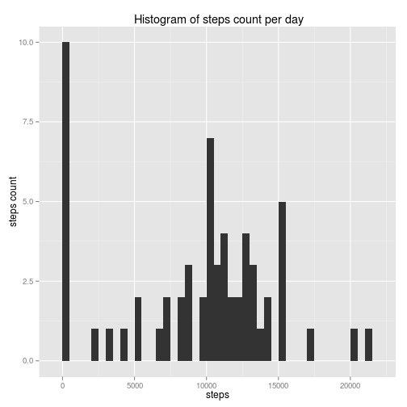
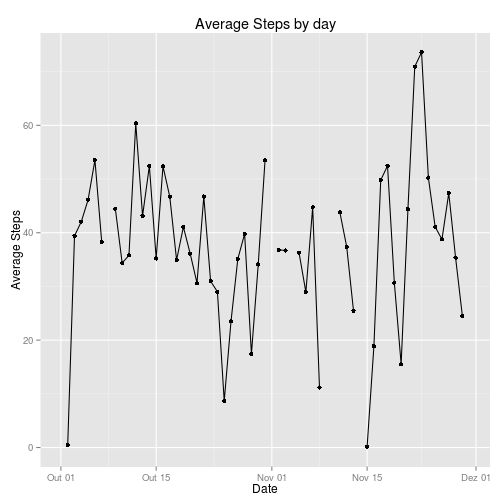
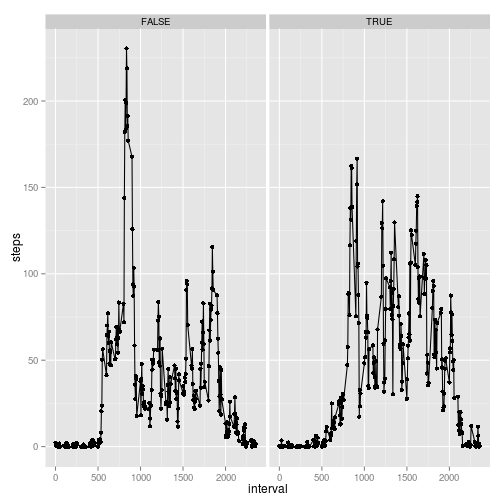

## Loading and preprocessing the data

After setting the rigth working directory we can start to handle the data with the following commands.
```{r}
activity<- read.csv("activity.csv", stringsAsFactors = FALSE)
## Putting the date column in date format
activity$date<- as.Date(activity$date, "%Y-%m-%d")

```


## What is mean total number of steps taken per day?
First of all, let's agreggate the data, my personal choice was to use the tapply function but "by" or "aggregate" should work just fine.
After that, a ggplot function is made with qplot
```{r}
library(ggplot2)
agg_data <- tapply(activity$steps, activity$date, sum, na.rm= TRUE)
qplot(agg_data, binwidth = 500, xlab = "steps", ylab = "steps count", main = " Histogram of steps count per day", )
```


Note that the 0 is the biggest occurence because of the data 
And the summary function can give us the mean and median of the data
```{r}
summary(agg_data)
```
## What is the average daily activity pattern?
To answer that question the first code we need to run a aggregate function subsetting the data in days and taking the mean. In this section we used aggregate instead of tapply. 
```{r}
data_mean1<- aggregate(activity$steps, by = list(activity$date), mean, na.rm = TRUE)
```

Now using the ggplot2 library a graph showing the results is possible
```{r, warning= FALSE}
qplot(data_mean1$Group.1, data_mean1$x, geom = c("line", "point"), xlab = "Date", ylab = "Average Steps", main = "Average Steps by day")
```


## Imputing missing values

To realize how many missing values are in the data. The false values correspond the NAs in the data
```{r}
table(!is.na(activity$steps))
```

Now, it's time to estimate some NAs values. In the NAs values it will be assumed the mean of the 5 minute interval related to each NA. 

```{r}
new_act <- activity
new_act$steps <- as.numeric(new_act$steps)
new_act$steps <- ifelse( is.na(new_act$steps), tapply(new_act$steps, new_act$interval, mean, na.rm= TRUE), new_act$steps)
## To make the histogram, I used tapply just as the before
new_agg <- tapply(new_act$steps, new_act$date, sum, na.rm=TRUE)
qplot(new_agg, binwidth = 500, xlab = "steps", ylab = "steps count", main = " Histogram of steps count per day estimating NA's")
```


To compare the data a summary is enough
```{r}
summary(new_act$steps)
summary(activity$steps)
```
We can see that the mean changed signicantly. However, the median didn't changed.

## Are there differences in activity patterns between weekdays and weekends?

The graph generated in the code bellow answer that question:

```{r}
#Now a fourth column is made with a logical indicating TRUE to the weekend
library(chron)
new_act$weekday = chron::is.weekend(new_act$date)
agg_steps_int <- aggregate(steps ~ interval + weekday , data = new_act, mean)
agg_steps_int$weekday <- factor(agg_steps_int$weekday)
ggplot(data = agg_steps_int, aes(interval, steps)) + geom_line() + geom_point()+facet_grid(~weekday)
##
```


